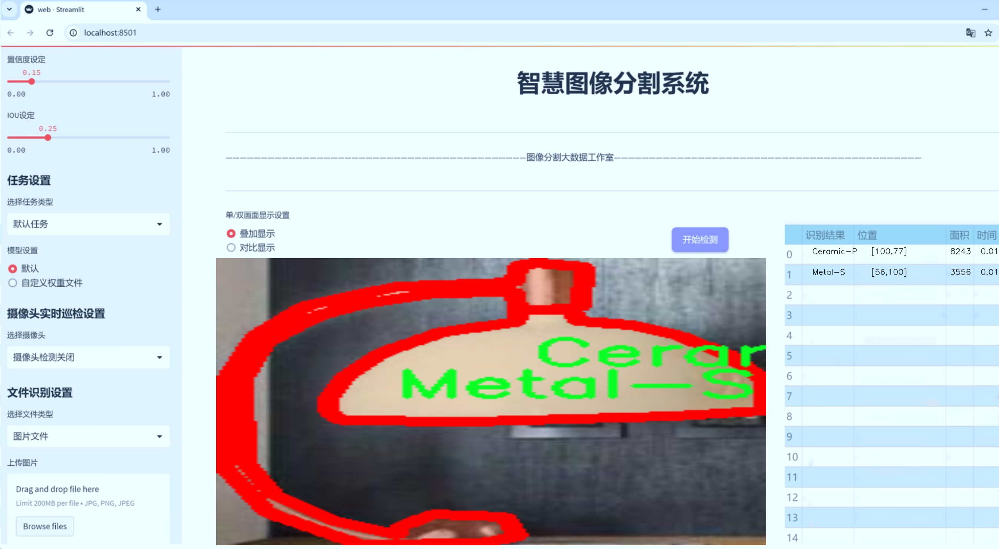

# 台灯材质识别图像分割系统源码＆数据集分享
 [yolov8-seg-convnextv2＆yolov8-seg-EfficientFormerV2等50+全套改进创新点发刊_一键训练教程_Web前端展示]

### 1.研究背景与意义

项目参考[ILSVRC ImageNet Large Scale Visual Recognition Challenge](https://gitee.com/YOLOv8_YOLOv11_Segmentation_Studio/projects)

项目来源[AAAI Global Al lnnovation Contest](https://kdocs.cn/l/cszuIiCKVNis)

研究背景与意义

随着智能家居和物联网技术的迅速发展，家居产品的智能化、个性化需求日益增加。台灯作为家居环境中不可或缺的照明设备，其材质的多样性和设计的独特性使得消费者在选择时面临诸多挑战。传统的台灯材质识别主要依赖人工经验，不仅效率低下，而且容易受到主观因素的影响。因此，开发一种高效、准确的台灯材质识别系统显得尤为重要。

在计算机视觉领域，图像分割技术的进步为物体识别提供了新的思路。YOLO（You Only Look Once）系列模型以其快速的实时检测能力和高准确率，成为目标检测领域的佼佼者。YOLOv8作为该系列的最新版本，结合了深度学习的先进技术，能够在复杂环境中实现高效的图像处理。然而，现有的YOLOv8模型在特定领域的应用上仍存在一定的局限性，尤其是在细粒度的材质识别任务中。因此，基于改进YOLOv8的台灯材质识别图像分割系统的研究具有重要的理论和实际意义。

本研究所使用的数据集包含1300张图像，涵盖17种不同的台灯材质类别，包括陶瓷、织物、玻璃、大理石、金属、塑料和木材等。这些材质的多样性为模型的训练提供了丰富的样本，有助于提高识别的准确性和鲁棒性。通过对这些图像进行实例分割，系统不仅能够识别出台灯的种类，还能准确区分不同材质的细微差别，从而为消费者提供更为精准的产品信息。

在实际应用中，基于改进YOLOv8的台灯材质识别系统能够广泛应用于电商平台、智能家居助手、室内设计软件等领域。通过自动识别和分类台灯材质，系统可以为用户提供个性化的推荐，提升购物体验。此外，该系统还可以帮助商家优化库存管理，减少因材质识别错误而导致的退换货率，从而提高运营效率。

综上所述，基于改进YOLOv8的台灯材质识别图像分割系统的研究，不仅具有重要的学术价值，还具备广泛的应用前景。通过提升台灯材质识别的准确性和效率，能够有效满足市场对智能家居产品的需求，推动家居行业的智能化进程。未来，随着深度学习技术的不断发展，该系统还可以扩展到更多家居产品的材质识别任务，为消费者提供更为全面的服务。

### 2.图片演示




##### 注意：由于此博客编辑较早，上面“2.图片演示”和“3.视频演示”展示的系统图片或者视频可能为老版本，新版本在老版本的基础上升级如下：（实际效果以升级的新版本为准）

  （1）适配了YOLOV8的“目标检测”模型和“实例分割”模型，通过加载相应的权重（.pt）文件即可自适应加载模型。

  （2）支持“图片识别”、“视频识别”、“摄像头实时识别”三种识别模式。

  （3）支持“图片识别”、“视频识别”、“摄像头实时识别”三种识别结果保存导出，解决手动导出（容易卡顿出现爆内存）存在的问题，识别完自动保存结果并导出到tempDir中。

  （4）支持Web前端系统中的标题、背景图等自定义修改，后面提供修改教程。

  另外本项目提供训练的数据集和训练教程,暂不提供权重文件（best.pt）,需要您按照教程进行训练后实现图片演示和Web前端界面演示的效果。

### 3.视频演示

[3.1 视频演示](https://www.bilibili.com/video/BV1ko21YsEsw/)

### 4.数据集信息展示

##### 4.1 本项目数据集详细数据（类别数＆类别名）

nc: 17
names: ['Ceramic-P', 'Ceramic-S', 'Ceramic-T', 'Fabric-P', 'Glass-P', 'Glass-S', 'Marble-S', 'Marble-T', 'Metal-P', 'Metal-S', 'Metal-T', 'Plastic-P', 'Plastic-S', 'Plastic-T', 'Wood-P', 'Wood-S', 'Wood-T']


##### 4.2 本项目数据集信息介绍

数据集信息展示

在本研究中，我们使用了名为“DeskTableLamps Material”的数据集，以训练和改进YOLOv8-seg模型，旨在实现高效的台灯材质识别图像分割系统。该数据集专注于多种台灯材质的分类与识别，包含了17个不同的类别，涵盖了从传统材料到现代合成材料的广泛范围。这些类别的多样性不仅为模型提供了丰富的训练样本，也为后续的图像分割任务奠定了坚实的基础。

具体而言，数据集中包含的类别包括：陶瓷（Ceramic-P、Ceramic-S、Ceramic-T）、织物（Fabric-P）、玻璃（Glass-P、Glass-S）、大理石（Marble-S、Marble-T）、金属（Metal-P、Metal-S、Metal-T）、塑料（Plastic-P、Plastic-S、Plastic-T）以及木材（Wood-P、Wood-S、Wood-T）。每一类材料都经过精心挑选，确保其在实际应用中的代表性和多样性。陶瓷类材料的细腻质感、织物类材料的柔和触感、玻璃类材料的透明度、大理石的纹理、金属的光泽、塑料的轻便性以及木材的自然纹理等，都为模型的训练提供了丰富的视觉特征。

在数据集的构建过程中，研究团队不仅注重材料的多样性，还考虑到了不同光照条件、拍摄角度和背景环境对图像分割效果的影响。这一系列的设计使得“DeskTableLamps Material”数据集具备了良好的泛化能力，能够有效应对现实世界中复杂的场景和条件。通过使用这一数据集，YOLOv8-seg模型能够学习到各类材料的独特特征，从而在图像分割任务中实现更高的准确性和鲁棒性。

此外，数据集中的每个类别都附带了详细的标注信息，确保模型在训练过程中能够获得准确的监督信号。这些标注不仅包括材料的类别标签，还涵盖了物体的边界框信息，进一步增强了模型的学习效果。通过对这些信息的充分利用，YOLOv8-seg模型能够在分割任务中精确地识别出不同材质的台灯，并有效区分它们之间的细微差别。

综上所述，“DeskTableLamps Material”数据集为本研究提供了一个全面而丰富的训练基础，使得改进后的YOLOv8-seg模型在台灯材质识别图像分割任务中具备了更强的能力。通过对该数据集的深入分析与应用，我们期望能够推动图像分割技术在家居物品识别领域的进一步发展，为智能家居系统的实现提供更为可靠的技术支持。


### 5.全套项目环境部署视频教程（零基础手把手教学）

[5.1 环境部署教程链接（零基础手把手教学）](https://www.bilibili.com/video/BV1jG4Ve4E9t/?vd_source=bc9aec86d164b67a7004b996143742dc)


[5.2 安装Python虚拟环境创建和依赖库安装视频教程链接（零基础手把手教学）](https://www.bilibili.com/video/BV1nA4VeYEze/?vd_source=bc9aec86d164b67a7004b996143742dc)

### 6.手把手YOLOV8-seg训练视频教程（零基础小白有手就能学会）

[6.1 手把手YOLOV8-seg训练视频教程（零基础小白有手就能学会）](https://www.bilibili.com/video/BV1cA4VeYETe/?vd_source=bc9aec86d164b67a7004b996143742dc)


按照上面的训练视频教程链接加载项目提供的数据集，运行train.py即可开始训练



     Epoch   gpu_mem       box       obj       cls    labels  img_size
     1/200     0G   0.01576   0.01955  0.007536        22      1280: 100%|██████████| 849/849 [14:42<00:00,  1.04s/it]
               Class     Images     Labels          P          R     mAP@.5 mAP@.5:.95: 100%|██████████| 213/213 [01:14<00:00,  2.87it/s]
                 all       3395      17314      0.994      0.957      0.0957      0.0843

     Epoch   gpu_mem       box       obj       cls    labels  img_size
     2/200     0G   0.01578   0.01923  0.007006        22      1280: 100%|██████████| 849/849 [14:44<00:00,  1.04s/it]
               Class     Images     Labels          P          R     mAP@.5 mAP@.5:.95: 100%|██████████| 213/213 [01:12<00:00,  2.95it/s]
                 all       3395      17314      0.996      0.956      0.0957      0.0845

     Epoch   gpu_mem       box       obj       cls    labels  img_size
     3/200     0G   0.01561    0.0191  0.006895        27      1280: 100%|██████████| 849/849 [10:56<00:00,  1.29it/s]
               Class     Images     Labels          P          R     mAP@.5 mAP@.5:.95: 100%|███████   | 187/213 [00:52<00:00,  4.04it/s]
                 all       3395      17314      0.996      0.957      0.0957      0.0845


### 7.50+种全套YOLOV8-seg创新点代码加载调参视频教程（一键加载写好的改进模型的配置文件）

[7.1 50+种全套YOLOV8-seg创新点代码加载调参视频教程（一键加载写好的改进模型的配置文件）](https://www.bilibili.com/video/BV1Hw4VePEXv/?vd_source=bc9aec86d164b67a7004b996143742dc)

### 8.YOLOV8-seg图像分割算法原理

原始YOLOv8-seg算法原理

YOLOv8-seg算法是YOLO系列的最新进展，承载着对目标检测与实例分割领域的重大创新。作为YOLOv5的继承者，YOLOv8在算法架构、数据处理和损失函数等多个方面进行了全面的优化和改进，旨在提高检测精度和速度，尤其是在复杂场景下的表现。其核心原理可以从数据预处理、骨干网络、特征融合、检测头结构以及标签分配策略等多个维度进行深入探讨。

首先，YOLOv8-seg在数据预处理阶段延续了YOLOv5的策略，采用了多种数据增强技术以提升模型的鲁棒性和泛化能力。其中，马赛克增强（Mosaic）通过将多张图像拼接成一张，能够有效增加训练样本的多样性；混合增强（Mixup）则通过对两张图像进行加权融合，进一步丰富了数据集的特征分布。此外，空间扰动（random perspective）和颜色扰动（HSV augment）技术也被引入，以模拟不同的拍摄条件和环境变化，从而提升模型在实际应用中的适应性。

在骨干网络结构方面，YOLOv8-seg继承了YOLOv5的设计理念，但对C3模块进行了创新，替换为新的C2f模块。C2f模块通过引入更多的分支和跳层连接，增强了特征的传递与融合能力，使得网络在特征提取过程中能够更好地捕捉到多尺度的信息。这种设计不仅提高了模型的表达能力，也为后续的特征融合打下了良好的基础。

YOLOv8-seg采用了FPN（特征金字塔网络）与PAN（路径聚合网络）相结合的结构，以实现多尺度特征的有效融合。FPN通过自上而下的方式将高层语义信息与低层细节信息结合，确保模型在处理不同尺度目标时能够保持较高的精度。而PAN则通过自下而上的路径聚合，进一步增强了特征的流动性和上下文信息的捕捉能力。这种特征融合策略使得YOLOv8-seg在面对复杂背景和小目标时，依然能够保持良好的检测性能。

在检测头的设计上，YOLOv8-seg引入了解耦头（Decoupled Head）结构，分别为分类和定位任务设计了独立的分支。这一变化使得模型在处理分类和回归任务时能够更加专注，减少了两者之间的干扰。解耦头的引入不仅提高了模型的精度，还加快了训练速度，适应了更复杂的目标检测需求。此外，YOLOv8-seg摒弃了传统的锚框（Anchor-based）策略，转而采用无锚（Anchor-free）的方法，这一转变在很大程度上简化了模型的设计，同时提升了检测的灵活性和准确性。

在标签分配策略方面，YOLOv8-seg采用了TOOD（Task-Oriented Object Detection）策略，这是一种动态标签分配机制。与YOLOv5的静态聚类方法不同，TOOD策略能够根据目标的实际分布动态调整正负样本的匹配，确保每个样本都能得到合理的处理。这种灵活的标签分配方式，使得模型在面对多样化的目标时，能够更好地适应不同的场景和条件。

损失函数的设计也是YOLOv8-seg的一大亮点。YOLOv8-seg引入了Varifocal Loss（VFL）作为分类损失，结合了CIoU（Complete Intersection over Union）和DFL（Distribution Focal Loss）作为回归损失。VFL通过对正负样本进行不对称加权，强调了高质量样本对模型训练的重要性，确保模型能够聚焦于那些更具代表性的样本，从而提升整体的检测性能。而CIoU和DFL的结合则进一步增强了模型在回归任务中的表现，使得定位精度得到了显著提升。

总的来说，YOLOv8-seg算法通过在数据预处理、骨干网络、特征融合、检测头结构以及标签分配策略等多个方面的创新与优化，极大地提升了目标检测与实例分割的性能。其在处理复杂场景和小目标时的优势，使得YOLOv8-seg成为计算机视觉领域中一款极具竞争力的模型。随着YOLOv8-seg的不断发展与应用，其在实际场景中的表现将为目标检测和实例分割任务带来新的机遇与挑战。


### 9.系统功能展示（检测对象为举例，实际内容以本项目数据集为准）

图9.1.系统支持检测结果表格显示

  图9.2.系统支持置信度和IOU阈值手动调节

  图9.3.系统支持自定义加载权重文件best.pt(需要你通过步骤5中训练获得)

  图9.4.系统支持摄像头实时识别

  图9.5.系统支持图片识别

  图9.6.系统支持视频识别

  图9.7.系统支持识别结果文件自动保存

  图9.8.系统支持Excel导出检测结果数据


### 10.50+种全套YOLOV8-seg创新点原理讲解（非科班也可以轻松写刊发刊，V11版本正在科研待更新）

#### 10.1 由于篇幅限制，每个创新点的具体原理讲解就不一一展开，具体见下列网址中的创新点对应子项目的技术原理博客网址【Blog】：


[10.1 50+种全套YOLOV8-seg创新点原理讲解链接](https://gitee.com/qunmasj/good)

#### 10.2 部分改进模块原理讲解(完整的改进原理见上图和技术博客链接)【如果此小节的图加载失败可以通过CSDN或者Github搜索该博客的标题访问原始博客，原始博客图片显示正常】
### YOLOv8简介
YOLOv8 尚未发表论文，因此我们无法直接了解其创建过程中进行的直接研究方法和消融研究。话虽如此，我们分析了有关模型的存储库和可用信息，以开始记录 YOLOv8 中的新功能。

如果您想自己查看代码，请查看YOLOv8 存储库并查看此代码差异以了解一些研究是如何完成的。

在这里，我们提供了有影响力的模型更新的快速总结，然后我们将查看模型的评估，这不言自明。

GitHub 用户 RangeKing 制作的下图显示了网络架构的详细可视化。


在这里插入图片描述


在这里插入图片描述

YOLOv8 架构，GitHub 用户 RangeKing 制作的可视化

无锚检测
YOLOv8 是一个无锚模型。这意味着它直接预测对象的中心而不是已知锚框的偏移量。


YOLO中anchor box的可视化

锚框是早期 YOLO 模型中众所周知的棘手部分，因为它们可能代表目标基准框的分布，而不是自定义数据集的分布。


YOLOv8 的检测头，在netron.app中可视化

Anchor free 检测减少了框预测的数量，从而加速了非最大抑制 (NMS)，这是一个复杂的后处理步骤，在推理后筛选候选检测。


YOLOv8 的检测头，在netron.app中可视化

新的卷积
stem 的第一个6x6conv 被替换为 a 3x3，主要构建块被更改，并且C2f替换了C3。该模块总结如下图，其中“f”是特征数，“e”是扩展率，CBS是由a Conv、a BatchNorm、a组成的block SiLU。

在中， （两个具有剩余连接的 3x3C2f的奇特名称）的所有输出都被连接起来。而在仅使用最后一个输出。Bottleneck``convs``C3``Bottleneck


新的 YOLOv8C2f模块

这Bottleneck与 YOLOv5 中的相同，但第一个 conv 的内核大小从更改1x1为3x3. 从这些信息中，我们可以看到 YOLOv8 开始恢复到 2015 年定义的 ResNet 块。

在颈部，特征直接连接而不强制使用相同的通道尺寸。这减少了参数数量和张量的整体大小。

### 空间和通道重建卷积SCConv
参考该博客提出的一种高效的卷积模块，称为SCConv (spatial and channel reconstruction convolution)，以减少冗余计算并促进代表性特征的学习。提出的SCConv由空间重构单元(SRU)和信道重构单元(CRU)两个单元组成。

（1）SRU根据权重分离冗余特征并进行重构，以抑制空间维度上的冗余，增强特征的表征。

（2）CRU采用分裂变换和融合策略来减少信道维度的冗余以及计算成本和存储。

（3）SCConv是一种即插即用的架构单元，可直接用于替代各种卷积神经网络中的标准卷积。实验结果表明，scconvo嵌入模型能够通过减少冗余特征来获得更好的性能，并且显著降低了复杂度和计算成本。


SCConv如图所示，它由两个单元组成，空间重建单元(SRU)和通道重建单元(CRU)，以顺序的方式放置。具体而言，对于瓶颈残差块中的中间输入特征X，首先通过SRU运算获得空间细化特征Xw，然后利用CRU运算获得信道细化特征Y。SCConv模块充分利用了特征之间的空间冗余和通道冗余，可以无缝集成到任何CNN架构中，以减少中间特征映射之间的冗余并增强CNN的特征表示。

#### SRU单元用于空间冗余


为了利用特征的空间冗余，引入了空间重构单元(SRU)，如图2所示，它利用了分离和重构操作。

分离操作 的目的是将信息丰富的特征图与空间内容对应的信息较少的特征图分离开来。我们利用组归一化(GN)层中的比例因子来评估不同特征图的信息内容。具体来说，给定一个中间特征映射X∈R N×C×H×W，首先通过减去平均值µ并除以标准差σ来标准化输入特征X，如下所示:


其中µ和σ是X的均值和标准差，ε是为了除法稳定性而加入的一个小的正常数，γ和β是可训练的仿射变换。

GN层中的可训练参数\gamma \in R^{C}用于测量每个批次和通道的空间像素方差。更丰富的空间信息反映了空间像素的更多变化，从而导致更大的γ。归一化相关权重W_{\gamma} \in R^{C}由下面公式2得到，表示不同特征映射的重要性。


然后将经Wγ重新加权的特征映射的权值通过sigmoid函数映射到(0,1)范围，并通过阈值进行门控。我们将阈值以上的权重设置为1，得到信息权重W1，将其设置为0，得到非信息权重W2(实验中阈值设置为0.5)。获取W的整个过程可以用公式表示。


最后将输入特征X分别乘以W1和W2，得到两个加权特征:信息量较大的特征X_{1}^{\omega }和信息量较小的特征X_{2}^{\omega }。这样就成功地将输入特征分为两部分:X_{1}^{\omega }具有信息量和表达性的空间内容，而X_{2}^{\omega }几乎没有信息，被认为是冗余的。

重构操作 将信息丰富的特征与信息较少的特征相加，生成信息更丰富的特征，从而节省空间空间。采用交叉重构运算，将加权后的两个不同的信息特征充分结合起来，加强它们之间的信息流。然后将交叉重构的特征X^{\omega1}和X^{\omega2}进行拼接，得到空间精细特征映射X^{\omega}。从后过程表示如下：


其中⊗是逐元素的乘法，⊕是逐元素的求和，∪是串联。将SRU应用于中间输入特征X后，不仅将信息特征与信息较少的特征分离，而且对其进行重构，增强代表性特征，抑制空间维度上的冗余特征。然而，空间精细特征映射X^{\omega}在通道维度上仍然是冗余的。

#### CRU单元用于通道冗余


分割 操作将输入的空间细化特征X^{\omega}分割成两个部分，一部分通道数是\alpha C，另一部分通道数是(1-\alpha) C，随后对两组特征的通道数使用1 * 1卷积核进行压缩，分别得到X_{up}和X_{low}。

转换 操作将输入的X_{up}作为“富特征提取”的输入，分别进行GWC和PWC，然后相加得到输出Y1，将输入X_{low}作为“富特征提取”的补充，进行PWC，得到的记过和原来的输入取并集得到Y2。

融合 操作使用简化的SKNet方法来自适应合并Y1和Y2。具体说是首先使用全局平均池化将全局空间信息和通道统计信息结合起来，得到经过池化的S1和S2。然后对S1和S2做Softmax得到特征权重向量\beta _{1}和\beta _{2}，最后使用特征权重向量得到输出Y = \beta _{1}*Y_{1} + \beta _{2}*Y_{2}，Y即为通道提炼的特征。


### 11.项目核心源码讲解（再也不用担心看不懂代码逻辑）

#### 11.1 ui.py

以下是对代码的核心部分进行提炼和详细注释的版本：

```python
import sys  # 导入sys模块，用于访问与Python解释器紧密相关的变量和函数
import subprocess  # 导入subprocess模块，用于执行外部命令

def run_script(script_path):
    """
    使用当前 Python 环境运行指定的脚本。

    Args:
        script_path (str): 要运行的脚本路径

    Returns:
        None
    """
    # 获取当前 Python 解释器的路径
    python_path = sys.executable

    # 构建运行命令，使用streamlit模块运行指定的脚本
    command = f'"{python_path}" -m streamlit run "{script_path}"'

    # 执行命令
    result = subprocess.run(command, shell=True)  # 使用shell执行命令
    if result.returncode != 0:  # 检查命令执行是否成功
        print("脚本运行出错。")  # 如果返回码不为0，表示出错，打印错误信息

# 实例化并运行应用
if __name__ == "__main__":
    # 指定要运行的脚本路径
    script_path = "web.py"  # 这里可以直接指定脚本名，假设在当前目录下

    # 运行脚本
    run_script(script_path)  # 调用run_script函数执行指定的脚本
```

### 代码核心部分分析：
1. **导入模块**：
   - `sys`模块用于获取当前Python解释器的路径。
   - `subprocess`模块用于执行外部命令。

2. **`run_script`函数**：
   - 接收一个脚本路径作为参数，并构建命令以运行该脚本。
   - 使用`subprocess.run`方法执行命令，并检查返回码以确定命令是否成功执行。

3. **主程序入口**：
   - 使用`if __name__ == "__main__":`确保只有在直接运行该脚本时才会执行后续代码。
   - 指定要运行的脚本路径，并调用`run_script`函数来执行该脚本。 

### 代码的功能：
该代码的主要功能是通过当前Python环境来运行一个指定的Streamlit脚本，并在运行过程中检查是否有错误发生。

这个程序文件名为 `ui.py`，它的主要功能是通过当前的 Python 环境来运行一个指定的脚本。程序首先导入了必要的模块，包括 `sys`、`os` 和 `subprocess`，以及一个自定义的路径处理模块 `abs_path`。

在文件中定义了一个名为 `run_script` 的函数，该函数接受一个参数 `script_path`，这个参数是要运行的脚本的路径。函数内部首先获取当前 Python 解释器的路径，使用 `sys.executable` 来实现。接着，构建一个命令字符串，使用 `streamlit` 来运行指定的脚本。命令的格式是将 Python 解释器路径和脚本路径组合成一个完整的命令。

随后，使用 `subprocess.run` 方法来执行这个命令，`shell=True` 参数表示在 shell 中执行该命令。执行完后，程序会检查返回的状态码，如果返回码不为 0，说明脚本运行过程中出现了错误，此时会打印出“脚本运行出错”的提示信息。

在文件的最后部分，使用 `if __name__ == "__main__":` 来判断当前模块是否是主程序，如果是，则指定要运行的脚本路径，这里是通过 `abs_path` 函数获取的 `web.py` 的绝对路径。最后，调用 `run_script` 函数来执行这个脚本。

总体来看，这个程序的设计是为了方便用户在当前的 Python 环境中运行一个名为 `web.py` 的脚本，利用 `streamlit` 框架来启动一个 Web 应用。

#### 11.2 model.py

以下是代码中最核心的部分，并附上详细的中文注释：

```python
# -*- coding: utf-8 -*-
import cv2  # 导入OpenCV库，用于处理图像和视频
import torch  # 导入PyTorch库，用于深度学习模型的操作
from ultralytics import YOLO  # 从ultralytics库中导入YOLO类，用于加载YOLO模型
from ultralytics.utils.torch_utils import select_device  # 导入选择设备的工具函数

# 根据是否有可用的GPU选择设备
device = "cuda:0" if torch.cuda.is_available() else "cpu"

# 初始化参数字典
ini_params = {
    'device': device,  # 设备类型，使用选择的设备
    'conf': 0.3,  # 物体置信度阈值，低于此值的检测结果将被忽略
    'iou': 0.05,  # 用于非极大值抑制的IOU阈值
    'classes': None,  # 类别过滤器，None表示不过滤任何类别
    'verbose': False  # 是否输出详细信息
}

class Web_Detector:  # 定义Web_Detector类
    def __init__(self, params=None):  # 构造函数
        self.model = None  # 初始化模型为None
        self.img = None  # 初始化图像为None
        self.params = params if params else ini_params  # 使用提供的参数或默认参数

    def load_model(self, model_path):  # 加载模型的方法
        self.device = select_device(self.params['device'])  # 选择设备
        self.model = YOLO(model_path)  # 加载YOLO模型
        # 预热模型，输入一个零张量以初始化模型
        self.model(torch.zeros(1, 3, 640, 640).to(self.device).type_as(next(self.model.model.parameters())))

    def preprocess(self, img):  # 图像预处理方法
        self.img = img  # 保存原始图像
        return img  # 返回处理后的图像

    def predict(self, img):  # 预测方法
        results = self.model(img, **ini_params)  # 使用模型进行预测
        return results  # 返回预测结果

    def postprocess(self, pred):  # 后处理方法
        results = []  # 初始化结果列表
        for res in pred[0].boxes:  # 遍历预测结果中的每个边界框
            class_id = int(res.cls.cpu())  # 获取类别ID
            bbox = res.xyxy.cpu().squeeze().tolist()  # 获取边界框坐标
            bbox = [int(coord) for coord in bbox]  # 转换边界框坐标为整数

            result = {
                "class_name": self.names[class_id],  # 类别名称
                "bbox": bbox,  # 边界框
                "score": res.conf.cpu().squeeze().item(),  # 置信度
                "class_id": class_id  # 类别ID
            }
            results.append(result)  # 将结果添加到列表

        return results  # 返回结果列表
```

### 代码核心部分说明：
1. **设备选择**：根据是否有可用的GPU选择设备，使用`torch.cuda.is_available()`判断。
2. **参数初始化**：设置YOLO模型的参数，包括设备类型、置信度阈值等。
3. **模型加载**：使用`YOLO`类加载模型，并进行预热以初始化模型参数。
4. **图像预处理**：保存输入图像以便后续使用。
5. **预测**：调用YOLO模型进行物体检测，返回预测结果。
6. **后处理**：解析预测结果，提取类别名称、边界框、置信度等信息，并将其整理成字典形式，最终返回结果列表。

这个程序文件 `model.py` 是一个用于图像检测的模块，主要基于YOLO（You Only Look Once）模型实现物体检测。文件中导入了多个库，包括OpenCV用于图像处理，PyTorch用于深度学习，QtFusion中的Detector和HeatmapGenerator类，以及Ultralytics库中的YOLO模型。

首先，程序设置了设备类型，如果系统支持CUDA，则使用GPU（"cuda:0"），否则使用CPU（"cpu"）。接着，定义了一些初始化参数，包括物体置信度阈值、IOU阈值和类别过滤器等。

接下来，定义了一个名为 `count_classes` 的函数，该函数用于统计检测结果中每个类别的数量。它接收检测信息和类别名称列表作为参数，返回一个包含每个类别计数的列表。

然后，定义了一个名为 `Web_Detector` 的类，该类继承自 `Detector`。在构造函数中，初始化了一些属性，包括模型、图像和类别名称。构造函数中还允许用户传入参数，如果没有提供，则使用默认参数。

`Web_Detector` 类中包含多个方法。`load_model` 方法用于加载YOLO模型，并根据模型路径判断任务类型（分割或检测）。它还将类别名称转换为中文，并进行模型预热，以确保模型能够正常工作。

`preprocess` 方法用于图像的预处理，简单地保存原始图像并返回。`predict` 方法接收处理后的图像并进行预测，返回检测结果。

`postprocess` 方法对预测结果进行后处理，提取每个检测框的信息，包括类别名称、边界框坐标、置信度和类别ID。结果以字典的形式存储在列表中并返回。

最后，`set_param` 方法允许更新检测器的参数，以便根据需要调整检测行为。

整体来看，这个程序文件提供了一个结构化的方式来实现基于YOLO的物体检测，支持中文类别名称的转换，并具备灵活的参数设置和结果处理功能。

#### 11.3 ultralytics\nn\extra_modules\kernel_warehouse.py

以下是经过简化并注释的核心代码部分，主要保留了 `Attention` 类和 `KWConvNd` 类的实现。这些类是实现注意力机制和卷积操作的关键部分。

```python
import torch
import torch.nn as nn
import torch.nn.functional as F

class Attention(nn.Module):
    def __init__(self, in_planes, reduction, num_static_cell, num_local_mixture, norm_layer=nn.BatchNorm1d,
                 cell_num_ratio=1.0, nonlocal_basis_ratio=1.0, start_cell_idx=None):
        super(Attention, self).__init__()
        # 计算隐藏层的通道数
        hidden_planes = max(int(in_planes * reduction), 16)
        self.kw_planes_per_mixture = num_static_cell + 1  # 每个混合的关键点通道数
        self.num_local_mixture = num_local_mixture  # 本地混合数
        self.kw_planes = self.kw_planes_per_mixture * num_local_mixture  # 总的关键点通道数

        # 计算本地和非本地单元的数量
        self.num_local_cell = int(cell_num_ratio * num_local_mixture)
        self.num_nonlocal_cell = num_static_cell - self.num_local_cell
        self.start_cell_idx = start_cell_idx

        # 定义网络层
        self.avgpool = nn.AdaptiveAvgPool1d(1)  # 自适应平均池化
        self.fc1 = nn.Linear(in_planes, hidden_planes, bias=(norm_layer is not nn.BatchNorm1d))  # 全连接层
        self.norm1 = norm_layer(hidden_planes)  # 归一化层
        self.act1 = nn.ReLU(inplace=True)  # 激活函数

        # 定义映射到单元的层
        if nonlocal_basis_ratio >= 1.0:
            self.map_to_cell = nn.Identity()  # 直接映射
            self.fc2 = nn.Linear(hidden_planes, self.kw_planes, bias=True)  # 映射层
        else:
            self.map_to_cell = self.map_to_cell_basis  # 使用基础映射
            self.num_basis = max(int(self.num_nonlocal_cell * nonlocal_basis_ratio), 16)  # 基础数量
            self.fc2 = nn.Linear(hidden_planes, (self.num_local_cell + self.num_basis + 1) * num_local_mixture, bias=False)
            self.fc3 = nn.Linear(self.num_basis, self.num_nonlocal_cell, bias=False)  # 非本地映射层
            self.basis_bias = nn.Parameter(torch.zeros([self.kw_planes], requires_grad=True).float())  # 基础偏置

        self.temp_bias = torch.zeros([self.kw_planes], requires_grad=False).float()  # 温度偏置
        self.temp_value = 0  # 温度值
        self._initialize_weights()  # 初始化权重

    def _initialize_weights(self):
        # 权重初始化
        for m in self.modules():
            if isinstance(m, nn.Linear):
                nn.init.kaiming_normal_(m.weight, mode='fan_out', nonlinearity='relu')  # Kaiming初始化
                if m.bias is not None:
                    nn.init.constant_(m.bias, 0)  # 偏置初始化为0
            if isinstance(m, nn.BatchNorm1d):
                nn.init.constant_(m.weight, 1)  # 归一化权重初始化为1
                nn.init.constant_(m.bias, 0)  # 偏置初始化为0

    def forward(self, x):
        # 前向传播
        x = self.avgpool(x.reshape(*x.shape[:2], -1)).squeeze(dim=-1)  # 平均池化
        x = self.act1(self.norm1(self.fc1(x)))  # 线性变换 -> 归一化 -> 激活
        x = self.map_to_cell(self.fc2(x)).reshape(-1, self.kw_planes)  # 映射到单元
        x = x / (torch.sum(torch.abs(x), dim=1).view(-1, 1) + 1e-3)  # 归一化
        x = (1.0 - self.temp_value) * x + self.temp_value * self.temp_bias.to(x.device).view(1, -1)  # 温度调整
        return x.reshape(-1, self.kw_planes_per_mixture)[:, :-1]  # 返回结果

class KWconvNd(nn.Module):
    def __init__(self, in_planes, out_planes, kernel_size, stride=1, padding=0, dilation=1, groups=1,
                 bias=False, warehouse_id=None, warehouse_manager=None):
        super(KWconvNd, self).__init__()
        self.in_planes = in_planes  # 输入通道数
        self.out_planes = out_planes  # 输出通道数
        self.kernel_size = kernel_size  # 卷积核大小
        self.stride = stride  # 步幅
        self.padding = padding  # 填充
        self.dilation = dilation  # 膨胀
        self.groups = groups  # 分组卷积
        self.bias = nn.Parameter(torch.zeros([self.out_planes]), requires_grad=True).float() if bias else None  # 偏置
        self.warehouse_id = warehouse_id  # 仓库ID
        self.warehouse_manager = [warehouse_manager]  # 仓库管理器

    def forward(self, x):
        # 前向传播
        # 获取注意力权重
        kw_attention = self.attention(x).type(x.dtype)
        batch_size = x.shape[0]  # 批大小
        x = x.reshape(1, -1, *x.shape[2:])  # 重塑输入
        weight = self.warehouse_manager[0].take_cell(self.warehouse_id).reshape(self.cell_shape[0], -1).type(x.dtype)  # 获取权重
        aggregate_weight = torch.mm(kw_attention, weight)  # 权重聚合
        # 进行卷积操作
        output = self.func_conv(x, weight=aggregate_weight, bias=None, stride=self.stride, padding=self.padding,
                                dilation=self.dilation, groups=self.groups * batch_size)
        output = output.view(batch_size, self.out_planes, *output.shape[2:])  # 重塑输出
        if self.bias is not None:
            output = output + self.bias.reshape(1, -1, *([1]*self.dimension))  # 添加偏置
        return output  # 返回输出
```

### 代码说明：
1. **Attention 类**：实现了一个注意力机制的模块，主要通过全连接层和归一化层来计算输入特征的注意力权重，并根据温度调整这些权重。
2. **KWconvNd 类**：实现了一个通用的卷积层，能够使用注意力机制来动态调整卷积权重，并支持多种卷积参数配置。该类的 `forward` 方法中结合了注意力权重和卷积操作，最终输出卷积结果。

这段代码是深度学习模型中实现注意力机制和卷积操作的核心部分，能够在特征提取中发挥重要作用。

这个程序文件 `kernel_warehouse.py` 是一个用于深度学习中卷积操作的模块，主要实现了一个“内核仓库”管理器，允许在不同的卷积层之间共享和重用卷积核，从而减少模型的参数数量和计算复杂度。文件中定义了多个类和函数，以下是对其主要内容的讲解。

首先，文件导入了一些必要的库，包括 PyTorch 的核心模块和一些功能模块。然后定义了一个工具函数 `parse`，用于处理输入参数，确保它们的格式符合预期。

接下来，定义了 `Attention` 类，这是一个注意力机制模块。它的构造函数接收多个参数，包括输入通道数、缩减比例、静态单元数量、局部混合数量等。该类通过自适应平均池化、全连接层和归一化层来计算注意力权重，并在前向传播中生成基于输入的权重。这些权重用于动态调整卷积核的使用，从而提高模型的表达能力。

`KWconvNd` 类是一个通用的卷积层实现，支持不同维度的卷积（1D、2D、3D）。它的构造函数接收卷积的输入输出通道、核大小、步幅、填充等参数，并在前向传播中使用注意力机制生成的权重来执行卷积操作。具体的卷积操作由 `func_conv` 属性指定，支持不同维度的卷积函数。

`KWConv1d`、`KWConv2d` 和 `KWConv3d` 类分别继承自 `KWconvNd`，实现了一维、二维和三维卷积的具体细节。它们定义了特定的维度和卷积函数。

`KWLinear` 类实现了线性层的功能，内部使用了一维卷积来处理输入数据。

`Warehouse_Manager` 类是内核仓库的管理器，负责管理不同卷积层的卷积核。它的构造函数接收多个参数，包括缩减比例、单元数量比例、共享范围等。该类提供了 `reserve` 方法，用于创建动态卷积层并记录其信息，`store` 方法用于存储卷积核，`allocate` 方法用于分配卷积核给网络中的卷积层。

最后，`KWConv` 类是一个简单的卷积模块，结合了卷积层、批归一化和激活函数，提供了一个完整的卷积操作接口。

此外，文件还定义了一个 `get_temperature` 函数，用于计算温度值，这在训练过程中可能用于调节模型的行为。

整体而言，这个文件实现了一个灵活的卷积核管理机制，通过注意力机制和动态卷积核的方式，提升了深度学习模型的效率和性能。

#### 11.4 ultralytics\nn\modules\transformer.py

以下是代码中最核心的部分，并附上详细的中文注释：

```python
import torch
import torch.nn as nn
import torch.nn.functional as F

class TransformerEncoderLayer(nn.Module):
    """定义一个Transformer编码器层。"""

    def __init__(self, c1, cm=2048, num_heads=8, dropout=0.0, act=nn.GELU(), normalize_before=False):
        """初始化TransformerEncoderLayer，设置参数。
        
        参数:
        c1: 输入特征的维度。
        cm: 前馈网络中间层的维度。
        num_heads: 多头注意力机制中的头数。
        dropout: dropout比率。
        act: 激活函数，默认为GELU。
        normalize_before: 是否在前向传播前进行归一化。
        """
        super().__init__()
        self.ma = nn.MultiheadAttention(c1, num_heads, dropout=dropout, batch_first=True)  # 多头注意力层
        self.fc1 = nn.Linear(c1, cm)  # 前馈网络的第一层
        self.fc2 = nn.Linear(cm, c1)  # 前馈网络的第二层
        self.norm1 = nn.LayerNorm(c1)  # 第一层归一化
        self.norm2 = nn.LayerNorm(c1)  # 第二层归一化
        self.dropout = nn.Dropout(dropout)  # dropout层
        self.dropout1 = nn.Dropout(dropout)  # 第一个dropout层
        self.dropout2 = nn.Dropout(dropout)  # 第二个dropout层
        self.act = act  # 激活函数
        self.normalize_before = normalize_before  # 是否在前向传播前进行归一化

    def forward(self, src, src_mask=None, src_key_padding_mask=None, pos=None):
        """通过编码器模块进行前向传播。
        
        参数:
        src: 输入特征。
        src_mask: 注意力掩码。
        src_key_padding_mask: 键的填充掩码。
        pos: 位置编码。
        
        返回:
        经过编码器层处理后的特征。
        """
        if self.normalize_before:
            src2 = self.norm1(src)  # 如果需要在前向传播前归一化
            q = k = self.with_pos_embed(src2, pos)  # 计算查询和键
            src2 = self.ma(q, k, value=src2, attn_mask=src_mask, key_padding_mask=src_key_padding_mask)[0]
            src = src + self.dropout1(src2)  # 残差连接
            src2 = self.norm2(src)  # 第二次归一化
            src2 = self.fc2(self.dropout(self.act(self.fc1(src2))))  # 前馈网络
            return src + self.dropout2(src2)  # 返回结果
        else:
            q = k = self.with_pos_embed(src, pos)  # 计算查询和键
            src2 = self.ma(q, k, value=src, attn_mask=src_mask, key_padding_mask=src_key_padding_mask)[0]
            src = src + self.dropout1(src2)  # 残差连接
            src = self.norm1(src)  # 归一化
            src2 = self.fc2(self.dropout(self.act(self.fc1(src))))  # 前馈网络
            return self.norm2(src + self.dropout2(src2))  # 返回结果

    @staticmethod
    def with_pos_embed(tensor, pos=None):
        """如果提供了位置编码，则将其添加到输入张量中。
        
        参数:
        tensor: 输入张量。
        pos: 位置编码。
        
        返回:
        添加了位置编码的张量。
        """
        return tensor if pos is None else tensor + pos

class MLPBlock(nn.Module):
    """实现一个多层感知机（MLP）块。"""

    def __init__(self, embedding_dim, mlp_dim, act=nn.GELU):
        """初始化MLPBlock，设置嵌入维度、MLP维度和激活函数。
        
        参数:
        embedding_dim: 输入嵌入的维度。
        mlp_dim: MLP的隐藏层维度。
        act: 激活函数，默认为GELU。
        """
        super().__init__()
        self.lin1 = nn.Linear(embedding_dim, mlp_dim)  # 第一层线性变换
        self.lin2 = nn.Linear(mlp_dim, embedding_dim)  # 第二层线性变换
        self.act = act()  # 激活函数实例化

    def forward(self, x: torch.Tensor) -> torch.Tensor:
        """进行MLP块的前向传播。
        
        参数:
        x: 输入张量。
        
        返回:
        经过MLP块处理后的张量。
        """
        return self.lin2(self.act(self.lin1(x)))  # 线性变换 -> 激活 -> 线性变换

class DeformableTransformerDecoderLayer(nn.Module):
    """可变形Transformer解码器层。"""

    def __init__(self, d_model=256, n_heads=8, d_ffn=1024, dropout=0., act=nn.ReLU(), n_levels=4, n_points=4):
        """初始化DeformableTransformerDecoderLayer，设置参数。
        
        参数:
        d_model: 输入特征的维度。
        n_heads: 多头注意力机制中的头数。
        d_ffn: 前馈网络的维度。
        dropout: dropout比率。
        act: 激活函数，默认为ReLU。
        n_levels: 特征层的数量。
        n_points: 每个层的采样点数量。
        """
        super().__init__()
        self.self_attn = nn.MultiheadAttention(d_model, n_heads, dropout=dropout)  # 自注意力层
        self.cross_attn = MSDeformAttn(d_model, n_levels, n_heads, n_points)  # 跨注意力层
        self.linear1 = nn.Linear(d_model, d_ffn)  # 前馈网络的第一层
        self.linear2 = nn.Linear(d_ffn, d_model)  # 前馈网络的第二层
        self.act = act  # 激活函数
        self.dropout1 = nn.Dropout(dropout)  # dropout层
        self.dropout2 = nn.Dropout(dropout)  # dropout层
        self.norm1 = nn.LayerNorm(d_model)  # 归一化层
        self.norm2 = nn.LayerNorm(d_model)  # 归一化层
        self.norm3 = nn.LayerNorm(d_model)  # 归一化层

    def forward(self, embed, refer_bbox, feats, shapes, padding_mask=None, attn_mask=None, query_pos=None):
        """进行解码器层的前向传播。
        
        参数:
        embed: 解码器的嵌入。
        refer_bbox: 参考边界框。
        feats: 图像特征。
        shapes: 特征形状。
        padding_mask: 填充掩码。
        attn_mask: 注意力掩码。
        query_pos: 查询位置编码。
        
        返回:
        经过解码器层处理后的特征。
        """
        # 自注意力
        q = k = self.with_pos_embed(embed, query_pos)  # 计算查询和键
        tgt = self.self_attn(q.transpose(0, 1), k.transpose(0, 1), embed.transpose(0, 1), attn_mask=attn_mask)[0].transpose(0, 1)
        embed = embed + self.dropout1(tgt)  # 残差连接
        embed = self.norm1(embed)  # 归一化

        # 跨注意力
        tgt = self.cross_attn(self.with_pos_embed(embed, query_pos), refer_bbox.unsqueeze(2), feats, shapes, padding_mask)
        embed = embed + self.dropout2(tgt)  # 残差连接
        embed = self.norm2(embed)  # 归一化

        # 前馈网络
        tgt2 = self.linear2(self.dropout3(self.act(self.linear1(embed))))  # 前馈网络
        return self.norm3(embed + tgt2)  # 返回结果

    @staticmethod
    def with_pos_embed(tensor, pos):
        """将位置编码添加到输入张量中（如果提供）。
        
        参数:
        tensor: 输入张量。
        pos: 位置编码。
        
        返回:
        添加了位置编码的张量。
        """
        return tensor if pos is None else tensor + pos
```

### 代码核心部分说明：
1. **TransformerEncoderLayer**：实现了Transformer编码器的基本结构，包括多头自注意力机制和前馈网络。提供了前向传播的两种方式（前归一化和后归一化）。
2. **MLPBlock**：实现了一个简单的多层感知机（MLP），包含两个线性层和一个激活函数。
3. **DeformableTransformerDecoderLayer**：实现了可变形Transformer解码器层，结合了自注意力和跨注意力机制，并通过前馈网络进行特征转换。

这些模块是构建Transformer模型的基础，广泛应用于计算机视觉和自然语言处理等领域。

这个程序文件定义了一系列与Transformer相关的模块，主要用于构建和实现Transformer模型，特别是在计算机视觉任务中的应用。文件中包含多个类，每个类都实现了特定的功能。

首先，`TransformerEncoderLayer`类定义了Transformer编码器的单层结构。它包含多头自注意力机制、前馈神经网络以及层归一化。构造函数中初始化了多头注意力层、前馈网络、归一化层和丢弃层。`forward`方法根据是否需要预归一化来选择不同的前向传播方式。

接下来，`AIFI`类是`TransformerEncoderLayer`的一个扩展，增加了对2D位置嵌入的支持。它的`forward`方法首先构建2D正弦余弦位置嵌入，然后将输入展平并进行前向传播，最后将输出重新调整为原始形状。

`TransformerLayer`类实现了一个简单的Transformer层，包含自注意力机制和前馈网络。它的`forward`方法对输入应用多头注意力和前馈网络，并返回结果。

`TransformerBlock`类则是一个完整的Transformer模块，包含多个`TransformerLayer`。它支持输入通道数的变化，并在必要时使用卷积层进行调整。

`MLPBlock`和`MLP`类实现了多层感知机（MLP），前者是一个单独的MLP块，后者则是一个完整的MLP网络，支持多层结构。

`LayerNorm2d`类实现了2D层归一化，适用于图像数据。它通过计算均值和方差来对输入进行归一化，并应用可学习的权重和偏置。

`MSDeformAttn`类实现了多尺度可变形注意力机制，允许模型在不同尺度上进行注意力计算。它的`forward`方法处理查询、参考边界框和特征图，计算注意力权重并返回加权的输出。

`DeformableTransformerDecoderLayer`和`DeformableTransformerDecoder`类实现了可变形Transformer解码器。解码器层包含自注意力和交叉注意力机制，并通过前馈网络进行处理。解码器则由多个解码器层组成，负责生成最终的输出，包括边界框和分类分数。

整体而言，这个文件实现了一个灵活且强大的Transformer框架，适用于各种视觉任务，尤其是在目标检测和图像处理领域。每个模块都可以独立使用或组合使用，以满足不同的需求。

#### 11.5 ui_style.py

以下是提取后的核心代码部分，并附上详细的中文注释：

```python
import base64  # 导入 base64 模块，用于处理 Base64 编码
import streamlit as st  # 导入 Streamlit 库，用于构建 web 应用

# 读取图片并转换为 Base64
def get_base64_of_bin_file(bin_file):
    # 以二进制模式打开文件
    with open(bin_file, 'rb') as file:
        data = file.read()  # 读取文件内容
    # 将读取的二进制数据进行 Base64 编码，并返回字符串形式
    return base64.b64encode(data).decode()

# 定义 CSS 样式
def def_css_hitml():
    # 使用 Streamlit 的 markdown 功能插入自定义 CSS 样式
    st.markdown("""
        <style>
        /* 全局样式 */
        .css-2trqyj, .css-1d391kg, .st-bb, .st-at {
            font-family: 'Gill Sans', 'Gill Sans MT', Calibri, 'Trebuchet MS', sans-serif;  /* 设置字体 */
            background-color: #cadefc;  /* 设置背景颜色 */
            color: #21618C;  /* 设置字体颜色 */
        }

        /* 按钮样式 */
        .stButton > button {
            border: none;  /* 去掉按钮边框 */
            color: white;  /* 设置按钮文字颜色 */
            padding: 10px 20px;  /* 设置按钮内边距 */
            text-align: center;  /* 设置文本居中 */
            display: inline-block;  /* 使按钮为块级元素 */
            font-size: 16px;  /* 设置字体大小 */
            margin: 2px 1px;  /* 设置按钮外边距 */
            cursor: pointer;  /* 鼠标悬停时显示为手型 */
            border-radius: 8px;  /* 设置按钮圆角 */
            background-color: #9896f1;  /* 设置按钮背景颜色 */
            box-shadow: 0 2px 4px 0 rgba(0,0,0,0.2);  /* 设置按钮阴影效果 */
            transition-duration: 0.4s;  /* 设置过渡效果时间 */
        }
        .stButton > button:hover {
            background-color: #5499C7;  /* 鼠标悬停时改变背景颜色 */
            color: white;  /* 鼠标悬停时保持文字颜色 */
            box-shadow: 0 8px 12px 0 rgba(0,0,0,0.24);  /* 鼠标悬停时改变阴影效果 */
        }

        /* 侧边栏样式 */
        .css-1lcbmhc.e1fqkh3o0 {
            background-color: #154360;  /* 设置侧边栏背景颜色 */
            color: #FDFEFE;  /* 设置侧边栏文字颜色 */
            border-right: 2px solid #DDD;  /* 设置右边框 */
        }

        /* 表格样式 */
        table {
            border-collapse: collapse;  /* 合并边框 */
            margin: 25px 0;  /* 设置表格外边距 */
            font-size: 18px;  /* 设置字体大小 */
            font-family: sans-serif;  /* 设置字体 */
            min-width: 400px;  /* 设置表格最小宽度 */
            box-shadow: 0 5px 15px rgba(0, 0, 0, 0.2);  /* 设置表格阴影效果 */
        }
        thead tr {
            background-color: #a8d8ea;  /* 设置表头背景颜色 */
            color: #ffcef3;  /* 设置表头文字颜色 */
            text-align: left;  /* 设置表头文本左对齐 */
        }
        th, td {
            padding: 15px 18px;  /* 设置单元格内边距 */
        }
        tbody tr {
            border-bottom: 2px solid #ddd;  /* 设置行底部边框 */
        }
        tbody tr:nth-of-type(even) {
            background-color: #D6EAF8;  /* 设置偶数行背景颜色 */
        }
        tbody tr:last-of-type {
            border-bottom: 3px solid #5499C7;  /* 设置最后一行底部边框 */
        }
        tbody tr:hover {
            background-color: #AED6F1;  /* 鼠标悬停时改变行背景颜色 */
        }
        </style>
        """, unsafe_allow_html=True)  # 允许使用 HTML 和 CSS
```

### 代码说明：
1. **导入模块**：导入 `base64` 用于处理文件的 Base64 编码，导入 `streamlit` 用于构建 Web 应用。
2. **get_base64_of_bin_file 函数**：该函数接受一个二进制文件路径，读取文件内容并将其转换为 Base64 编码的字符串。
3. **def_css_hitml 函数**：该函数定义了一系列 CSS 样式，用于美化 Streamlit 应用的界面，包括全局样式、按钮样式、侧边栏样式和表格样式。通过 `st.markdown` 方法将 CSS 样式应用到应用中。

这个程序文件 `ui_style.py` 是一个用于 Streamlit 应用的样式定义文件。它主要包含了自定义的 CSS 样式，用于美化应用的界面。以下是对代码的逐行解释。

首先，程序导入了 `base64` 和 `streamlit` 库。`base64` 用于处理二进制数据的编码，而 `streamlit` 是一个用于构建数据应用的库。

接下来，定义了一个函数 `get_base64_of_bin_file(bin_file)`，该函数接受一个二进制文件的路径作为参数。它打开文件并读取其内容，然后将读取到的二进制数据编码为 Base64 格式，并返回这个编码后的字符串。这在需要将图像或其他二进制文件嵌入到 HTML 中时非常有用。

然后，定义了另一个函数 `def_css_hitml()`，该函数使用 `st.markdown()` 方法将一段 CSS 样式嵌入到 Streamlit 应用中。这里的 CSS 样式包括多个部分：

1. **全局样式**：设置了应用的字体、背景颜色和文字颜色，确保整体视觉风格统一。

2. **按钮样式**：定义了按钮的外观，包括边框、颜色、内边距、字体大小、边距、圆角、背景色和阴影效果。同时还设置了按钮在鼠标悬停时的样式变化，使其更加吸引用户。

3. **侧边栏样式**：为侧边栏设置了背景色、文字颜色和边框样式，增强了侧边栏的可读性和美观性。

4. **Radio 按钮样式**：自定义了单选按钮的外观，使其更具交互性和视觉吸引力。

5. **滑块样式**：为滑块的滑块部分和轨道部分设置了背景颜色，提升了用户体验。

6. **表格样式**：定义了表格的整体样式，包括边框合并、字体、阴影效果、表头和表格行的背景色等。特别是设置了交替行的背景色和鼠标悬停时的高亮效果，使得表格数据更加易于阅读。

最后，使用 `unsafe_allow_html=True` 参数，允许在 Streamlit 中渲染 HTML 和 CSS。这使得自定义样式能够正确应用于 Streamlit 应用的界面。

总体而言，这个文件通过自定义 CSS 样式来增强 Streamlit 应用的视觉效果和用户体验，使得应用看起来更加美观和专业。

#### 11.6 train.py

以下是经过简化并添加详细中文注释的核心代码部分：

```python
import os
import torch
import yaml
from ultralytics import YOLO  # 导入YOLO模型库

if __name__ == '__main__':  # 确保该模块被直接运行时才执行以下代码
    # 设置训练参数
    workers = 1  # 数据加载的工作进程数
    batch = 8  # 每个批次的样本数量
    device = "0" if torch.cuda.is_available() else "cpu"  # 检查是否有可用的GPU

    # 获取数据集配置文件的绝对路径
    data_path = abs_path(f'datasets/data/data.yaml', path_type='current')

    # 将路径格式转换为Unix风格
    unix_style_path = data_path.replace(os.sep, '/')
    # 获取数据集目录路径
    directory_path = os.path.dirname(unix_style_path)

    # 读取YAML配置文件
    with open(data_path, 'r') as file:
        data = yaml.load(file, Loader=yaml.FullLoader)

    # 修改数据集路径
    if 'train' in data and 'val' in data and 'test' in data:
        data['train'] = directory_path + '/train'  # 更新训练集路径
        data['val'] = directory_path + '/val'      # 更新验证集路径
        data['test'] = directory_path + '/test'    # 更新测试集路径

        # 将修改后的数据写回YAML文件
        with open(data_path, 'w') as file:
            yaml.safe_dump(data, file, sort_keys=False)

    # 加载YOLO模型配置和预训练权重
    model = YOLO(r"C:\codeseg\codenew\50+种YOLOv8算法改进源码大全和调试加载训练教程（非必要）\改进YOLOv8模型配置文件\yolov8-seg-C2f-Faster.yaml").load("./weights/yolov8s-seg.pt")

    # 开始训练模型
    results = model.train(
        data=data_path,  # 指定训练数据的配置文件路径
        device=device,    # 指定训练设备
        workers=workers,  # 数据加载的工作进程数
        imgsz=640,        # 输入图像的大小
        epochs=100,       # 训练的轮数
        batch=batch,      # 每个批次的样本数量
    )
```

### 代码注释说明：
1. **导入库**：导入必要的库，包括`os`、`torch`、`yaml`和YOLO模型库。
2. **主程序入口**：使用`if __name__ == '__main__':`确保代码块仅在直接运行时执行。
3. **参数设置**：设置数据加载的工作进程数、批次大小和设备（GPU或CPU）。
4. **数据集路径**：获取数据集配置文件的绝对路径，并转换为Unix风格的路径。
5. **读取和修改YAML文件**：读取YAML文件，更新训练、验证和测试集的路径，并将修改后的内容写回文件。
6. **加载模型**：加载YOLO模型的配置文件和预训练权重。
7. **训练模型**：调用`model.train()`方法开始训练，传入数据路径、设备、工作进程数、图像大小、训练轮数和批次大小等参数。

这个程序文件`train.py`主要用于训练YOLO（You Only Look Once）模型，具体是YOLOv8版本的模型。程序的主要流程包括设置训练参数、读取数据集配置、修改数据路径、加载模型以及开始训练。

首先，程序导入了必要的库，包括`os`、`torch`、`yaml`、`ultralytics`中的YOLO模型以及`matplotlib`。`matplotlib`的使用设置为'TkAgg'，这可能是为了在训练过程中可视化结果。

在`__main__`块中，程序首先定义了一些训练参数，如`workers`（工作进程数）、`batch`（每个批次的样本数）和`device`（设备选择，优先使用GPU）。接着，程序通过`abs_path`函数获取数据集配置文件的绝对路径，该文件是一个YAML格式的文件，包含了训练、验证和测试数据的路径。

程序将获取到的路径转换为Unix风格的路径，并提取出目录路径。然后，它打开YAML文件并读取内容，使用`yaml.load`函数保持原有顺序。接下来，程序检查YAML文件中是否包含'train'、'val'和'test'的项，如果有，则将这些项的路径修改为相对于当前目录的路径，并将修改后的内容写回到YAML文件中。

在模型加载部分，程序使用YOLO类加载一个特定的模型配置文件（`yolov8-seg-C2f-Faster.yaml`）和预训练权重（`yolov8s-seg.pt`）。这一步是为了准备训练所需的模型。

最后，程序调用`model.train`方法开始训练，传入训练数据的配置文件路径、设备、工作进程数、输入图像大小、训练的epoch数以及批次大小等参数。训练过程中，模型会根据提供的数据进行学习和优化。

总的来说，这个程序文件是一个完整的YOLOv8模型训练脚本，涵盖了从数据准备到模型训练的各个步骤。

### 12.系统整体结构（节选）

### 整体功能和构架概括

该项目是一个基于YOLO（You Only Look Once）模型的计算机视觉应用，主要用于物体检测和图像处理。项目的整体架构分为多个模块，每个模块负责特定的功能，协同工作以实现完整的训练、推理和用户界面。主要功能包括：

1. **模型训练**：使用YOLOv8模型进行物体检测的训练，支持自定义数据集。
2. **模型推理**：实现对图像或视频的实时物体检测。
3. **用户界面**：通过Streamlit构建的Web界面，方便用户与模型进行交互，查看检测结果和训练进度。
4. **样式和布局**：自定义用户界面的样式，使其更加美观和用户友好。
5. **数据处理**：包括数据加载、预处理和后处理，确保输入数据的质量和格式符合模型要求。

### 文件功能整理表

| 文件路径                                           | 功能描述                                                         |
|---------------------------------------------------|------------------------------------------------------------------|
| `ui.py`                                          | 运行Streamlit应用，启动指定的Web界面脚本（如`web.py`）。        |
| `model.py`                                       | 实现YOLO模型的物体检测功能，包括模型加载、预测和结果处理。      |
| `ultralytics/nn/extra_modules/kernel_warehouse.py` | 管理卷积核的共享和重用，优化模型的参数和计算效率。              |
| `ultralytics/nn/modules/transformer.py`         | 实现Transformer模块，支持自注意力机制和多尺度处理。              |
| `ui_style.py`                                    | 定义Streamlit应用的自定义CSS样式，增强用户界面的视觉效果。      |
| `train.py`                                       | 训练YOLOv8模型，处理数据集配置，加载模型并开始训练过程。        |
| `ultralytics/__init__.py`                        | 初始化Ultralytics库，可能包含库的版本信息和基本配置。            |
| `ultralytics/hub/__init__.py`                   | 初始化Hub模块，可能用于模型的下载和管理。                        |
| `ultralytics/models/rtdetr/val.py`               | 实现RT-DETR模型的验证功能，评估模型在验证集上的性能。            |
| `ultralytics/utils/callbacks/dvc.py`            | 实现与DVC（数据版本控制）相关的回调功能，管理模型训练过程中的数据版本。 |
| `ultralytics/data/loaders.py`                    | 数据加载器的实现，负责从数据集读取和预处理数据。                |
| `ultralytics/trackers/utils/matching.py`        | 实现物体跟踪的匹配算法，处理跟踪过程中物体的匹配和更新。        |
| `ultralytics/models/yolo/classify/predict.py`   | 实现YOLO模型的分类预测功能，处理图像分类任务。                  |

这个表格总结了每个文件的主要功能，展示了项目的模块化设计和各个组件之间的协作关系。

注意：由于此博客编辑较早，上面“11.项目核心源码讲解（再也不用担心看不懂代码逻辑）”中部分代码可能会优化升级，仅供参考学习，完整“训练源码”、“Web前端界面”和“50+种创新点源码”以“14.完整训练+Web前端界面+50+种创新点源码、数据集获取”的内容为准。

### 13.图片、视频、摄像头图像分割Demo(去除WebUI)代码

在这个博客小节中，我们将讨论如何在不使用WebUI的情况下，实现图像分割模型的使用。本项目代码已经优化整合，方便用户将分割功能嵌入自己的项目中。
核心功能包括图片、视频、摄像头图像的分割，ROI区域的轮廓提取、类别分类、周长计算、面积计算、圆度计算以及颜色提取等。
这些功能提供了良好的二次开发基础。

### 核心代码解读

以下是主要代码片段，我们会为每一块代码进行详细的批注解释：

```python
import random
import cv2
import numpy as np
from PIL import ImageFont, ImageDraw, Image
from hashlib import md5
from model import Web_Detector
from chinese_name_list import Label_list

# 根据名称生成颜色
def generate_color_based_on_name(name):
    ......

# 计算多边形面积
def calculate_polygon_area(points):
    return cv2.contourArea(points.astype(np.float32))

...
# 绘制中文标签
def draw_with_chinese(image, text, position, font_size=20, color=(255, 0, 0)):
    image_pil = Image.fromarray(cv2.cvtColor(image, cv2.COLOR_BGR2RGB))
    draw = ImageDraw.Draw(image_pil)
    font = ImageFont.truetype("simsun.ttc", font_size, encoding="unic")
    draw.text(position, text, font=font, fill=color)
    return cv2.cvtColor(np.array(image_pil), cv2.COLOR_RGB2BGR)

# 动态调整参数
def adjust_parameter(image_size, base_size=1000):
    max_size = max(image_size)
    return max_size / base_size

# 绘制检测结果
def draw_detections(image, info, alpha=0.2):
    name, bbox, conf, cls_id, mask = info['class_name'], info['bbox'], info['score'], info['class_id'], info['mask']
    adjust_param = adjust_parameter(image.shape[:2])
    spacing = int(20 * adjust_param)

    if mask is None:
        x1, y1, x2, y2 = bbox
        aim_frame_area = (x2 - x1) * (y2 - y1)
        cv2.rectangle(image, (x1, y1), (x2, y2), color=(0, 0, 255), thickness=int(3 * adjust_param))
        image = draw_with_chinese(image, name, (x1, y1 - int(30 * adjust_param)), font_size=int(35 * adjust_param))
        y_offset = int(50 * adjust_param)  # 类别名称上方绘制，其下方留出空间
    else:
        mask_points = np.concatenate(mask)
        aim_frame_area = calculate_polygon_area(mask_points)
        mask_color = generate_color_based_on_name(name)
        try:
            overlay = image.copy()
            cv2.fillPoly(overlay, [mask_points.astype(np.int32)], mask_color)
            image = cv2.addWeighted(overlay, 0.3, image, 0.7, 0)
            cv2.drawContours(image, [mask_points.astype(np.int32)], -1, (0, 0, 255), thickness=int(8 * adjust_param))

            # 计算面积、周长、圆度
            area = cv2.contourArea(mask_points.astype(np.int32))
            perimeter = cv2.arcLength(mask_points.astype(np.int32), True)
            ......

            # 计算色彩
            mask = np.zeros(image.shape[:2], dtype=np.uint8)
            cv2.drawContours(mask, [mask_points.astype(np.int32)], -1, 255, -1)
            color_points = cv2.findNonZero(mask)
            ......

            # 绘制类别名称
            x, y = np.min(mask_points, axis=0).astype(int)
            image = draw_with_chinese(image, name, (x, y - int(30 * adjust_param)), font_size=int(35 * adjust_param))
            y_offset = int(50 * adjust_param)

            # 绘制面积、周长、圆度和色彩值
            metrics = [("Area", area), ("Perimeter", perimeter), ("Circularity", circularity), ("Color", color_str)]
            for idx, (metric_name, metric_value) in enumerate(metrics):
                ......

    return image, aim_frame_area

# 处理每帧图像
def process_frame(model, image):
    pre_img = model.preprocess(image)
    pred = model.predict(pre_img)
    det = pred[0] if det is not None and len(det)
    if det:
        det_info = model.postprocess(pred)
        for info in det_info:
            image, _ = draw_detections(image, info)
    return image

if __name__ == "__main__":
    cls_name = Label_list
    model = Web_Detector()
    model.load_model("./weights/yolov8s-seg.pt")

    # 摄像头实时处理
    cap = cv2.VideoCapture(0)
    while cap.isOpened():
        ret, frame = cap.read()
        if not ret:
            break
        ......

    # 图片处理
    image_path = './icon/OIP.jpg'
    image = cv2.imread(image_path)
    if image is not None:
        processed_image = process_frame(model, image)
        ......

    # 视频处理
    video_path = ''  # 输入视频的路径
    cap = cv2.VideoCapture(video_path)
    while cap.isOpened():
        ret, frame = cap.read()
        ......
```


### 14.完整训练+Web前端界面+50+种创新点源码、数据集获取


# [下载链接：https://mbd.pub/o/bread/ZpyZlZ1w](https://mbd.pub/o/bread/ZpyZlZ1w)